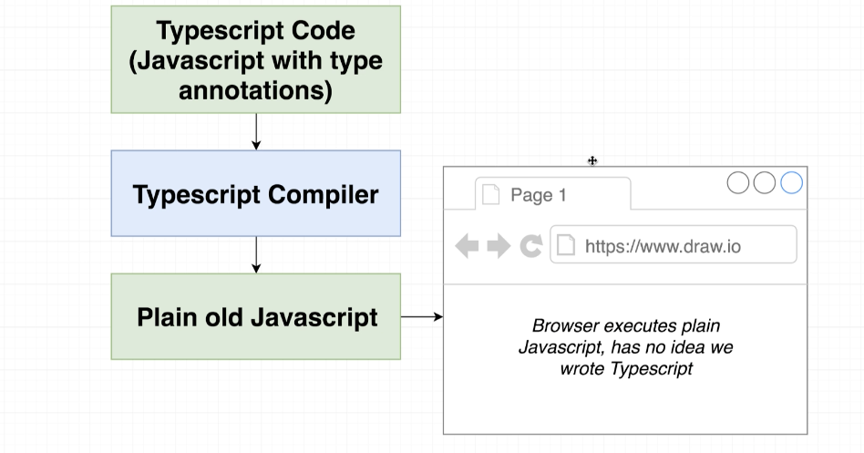
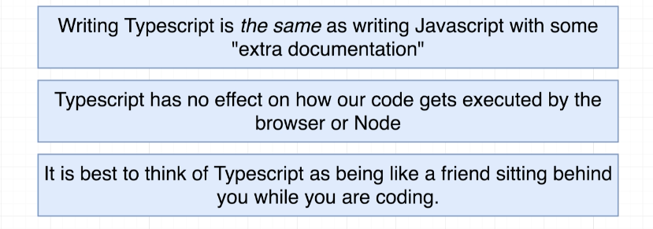

# TypeScript Guide

A guide to typescript.

Go to the [docs](./docs/00-index.md).

## Introduction

> **TypeScript = JavaScript + A Type System**

TypeScript is an open-source language which builds on JavaScript, one of the world’s most used tools, by adding static type definitions.

|
|--

#### Types

Types provide a way to describe the shape of an object, providing better documentation, and allowing TypeScript to validate that your code is working correctly.

#### The TS Type System:

 - Helps us catch errors during *development*
 - Uses 'type annotations' to analyze our code
 - Only active during development
 - Doesn't provide any performance optimization

#### TypeScript vs JavaScript

JavaScript uses 'dynamic types' (resolved at runtime), whereas TypeScript uses 'static types' (set during development).

Put another way:

JavaScript is a dynamic language and TypeScript is a static(ally typed) language (like C# or Java).

#### How to use TypeScript

TypeScript code is transformed into JavaScript code via the TypeScript compiler or Babel.

|
|--

#### Summary

|
|--

 

## Table of Contents

### Part 1: Type System and Type Annotations

 - [01 - What is a Type System](/docs/01-type-system.md)
 - [02 - Type Annotations and Type Inference](/docs/02-type-annotations-and-inference.md)
 - [03 - Type Annotations with Functions and Objects](/docs/03-type-annotations-with-functions.md)
 - [04 - Type Annotations with Objects](/docs/04-type-annotations-with-objects.md)
 - [05 - Type Annotations with Arrays](/docs/05-type-annotations-with-arrays.md)
 - [06 - Type Annotations with Tuples (And Type Aliases)](/docs/06-type-annotations-with-tuples.md)

### Part 2a: Classes and Interfaces

 - [07 - Interfaces and Type Aliases](/docs/07-interfaces.md)
 - [08 - Classes](/docs/08-classes.md)

### Part 2b: Object Oriented Programming Principles

 - [09 - Object Oriented Programming Principles](/docs/09-object-oriented-programming.md)

### Part 3: Design Patterns

 - [10 - Design Patterns with TypeScript](/docs/10-design-patterns.md)

### Part 4: Misc | Intermediate (?)

 - [11 - Narrowing (Type Guards)](/docs/11-type-guards.md)
 - [12 - Enums](/docs/12-enums.md)
 - [13 - Type Assertions](/docs/13-type-assertions.md)

### Part 5: Advanced

 - [14 - Generics](/docs/14-generics.md)
 - [15 - Decorators](/docs/15-decorators.md)
 - [16 - Metadata](/docs/16-metadata.md)

### Part 6: Integrating TypeScript with JS Libraries

 - [17 - TypeScript + JS Libraries](/docs/17-ts-and-js-libraries.md)
 - [18 - Express + TypeScript](/docs/18-ts-and-express.md)
 - [19 - React + TypeScript](/docs/19-ts-and-react.md)

### Appendix A: TypeScript Setup

 - [20 - TypeScript Setup and Configuration](/docs/20-ts-setup.md)

### Appendix B: TypeScript and Webpack

 - [21 - TypeScript and Webpack](/docs/21-ts-webpack.md)

### Resources

 - [TypeScript: The Complete Developer's Guide](https://www.udemy.com/course/typescript-the-complete-developers-guide)
 - [Understanding TypeScript](https://www.udemy.com/course/understanding-typescript)

 - [https://www.typescriptlang.org/](https://www.typescriptlang.org/)
