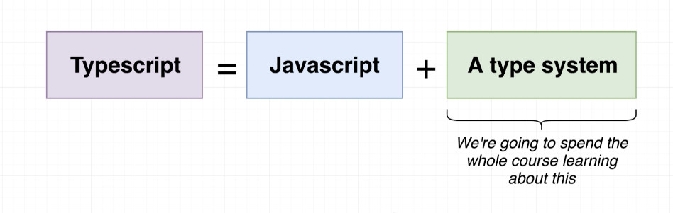

# TypeScript Guide

A guide to typescript.

Go to the [docs](./docs/00-index.md).

## Introduction

> **TypeScript = JavaScript + A Type System**

TypeScript is an open-source language which builds on JavaScript, one of the world’s most used tools, by adding static type definitions.

|
|--

#### Types

Types provide a way to describe the shape of an object, providing better documentation, and allowing TypeScript to validate that your code is working correctly.

#### The TS Type System:

 - Helps us catch errors during *development*
 - Uses 'type annotations' to analyze our code
 - Only active during development
 - Doesn't provide any performance optimization

#### How to use TypeScript

TypeScript code is transformed into JavaScript code via the TypeScript compiler or Babel.

|
|--

#### Summary

|
|--

### Resources

 - [TypeScript: The Complete Developer's Guide](https://www.udemy.com/course/typescript-the-complete-developers-guide)

 - [https://www.typescriptlang.org/](https://www.typescriptlang.org/)