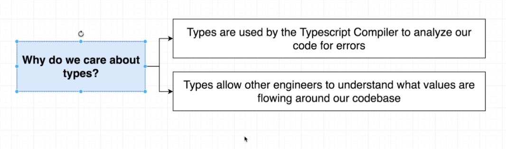

# TypeScript Guide - What is a Type System
Quick Links: [ReadMe](../README.md) | [Table of Contents](./docs/00-index.md)

---

## What is a Type System

A [type system](https://codeburst.io/types-type-systems-and-typescript-4ac858298e5e) is a set of rules for performing various consistency and correctness checks in a program.

**Type**

An easy way to refer to the different properties and functions that a value has.

#### Why do we care about types ? 

|
|--

## Categories of Types

#### Primitive Types

 - number
 - string
 - boolean
 - null
 - undefined
 - void
 - symbol

#### Complex Types

 - arrays
 - objects
 - functions
 - classes