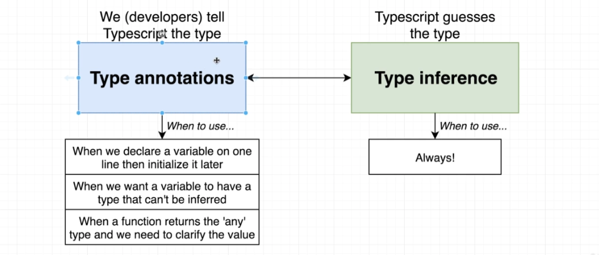

# TypeScript Guide - Type Annotations and Inference
Quick Links: [ReadMe](../README.md) | [Table of Contents](./docs/00-index.md)

---

## Type Annotations and Inference

### Type Annotation

 - Code we add to tell TypeScript what type of value a variable will refer to.
 - We tell TypeScript the type.

### Type Inference

 - TypeScript tries to figure out what type of value a variable refers to.
 - TypeScript guesses the type.

<br />

#### How Type Inference Works

In TypeScript, there are several places where type inference is used to provide type information when there is no explicit type annotation. 


```ts
const color;   // variable declaration
color = 'red'; // variable initialization

const color = 'red'; // variable declaration & initialization
```

> **Rule of Thumb:**
If declaration and initialization are on the same line, TypeScript will figure out the type of 'color' for us.

<br />

#### When to use Type Annotations and Type Inference

|
|--

**Note:** Some of these cases have intentional bad code just to make a point.


**Case 1: When we declare a variable on one line and initialize it later**

```ts
let words = ['red', 'green', 'blue'];
// either initialize or annotate the following line.
// let foundWord; // uninitialized, not annotated.
let foundWord: boolean; // annotated - second best option
// let foundWord = false; // initialized - preferable
// let foundWord: boolean = false; // annotated and initialized - unnecessary

for(let i = 0; i < words.length; i++) {
  if (words[i] === 'green') {
    foundWord = true;
  }
}
```

**Case 2: Variable whose type cannot be inferred correctly (Union Types)**

If you want to allow multiple different types for a variable / object.

```ts
let numbers = [-10, -1, 12];
let numberAboveZero: boolean | number = false;

for (let i = 0; i < numbers.length; i++) {
  if (numbers[i] > 0) {
    numberAboveZero = numbers[i];
  }
}
```

**Case 3: Function that returns the 'any' type**

if we were to mouse over 'coordinates' here, it has a type annotation of `any`, which means that TypeScript does not not what the type should be.

```ts
const json = '{"x": 10, "y": 20}';
const coordinates: { x: number; y: number; } = JSON.parse(json);
console.log(coordinates); // {x: 10, y: 20};
```

<br />

### Annotating Primitives

> **Numbers**
```ts
let age: number = 38;

const apples: number = 5;
```

> **Strings**
```ts
const name: string = 'Christopher';

let speed: string = 'fast';
```

> **Booleans**
```ts
let hasName: boolean = true;

let isSomething: boolean;
```

> **Null**
```ts
// here, the variable 'nothingMuch' has both a value and a type equal to null.
let nothingMuch: null = null;
```

> **Undefined**
```ts
let nothing: undefined = undefined;
```

> **Unknown**
```ts
let userInput: unknown;
```

> **Built in Objects - Dates**
```ts
let now: Date = new Date();
```

<br /><br />

### Annotating Complex Types

> **Arrays**
```ts
// primitive arrays
let colors: string[] = ['red', 'green', 'blue'];
let myNumbers: number[] = [1,2,3,4,5];
let truths: boolean[] = [true, true, false];

// Array of objects
let people: {
  name: string;
  age: number;
}[];

```

> **Classes**
```ts
class Car {}

let car: Car = new Car();
```

> **Object Literals**
```ts
let point: { x: number; y: number; } = {
  x: 10,
  y: 20,
};
```

> **Object literal with unknown property names**

Given a JavaScript object with unknown property names (but known property values) we can create a type or interface using the `[key: type]: type` syntax where the first type refers to the key type and the second to the value type.

```ts
type Props = {
  [key: string]: string;
};
```

```ts
export interface RequestWithBody extends Request {
  body: { [key: string]: string | undefined };
}
```

<br /><br />

### Annotating Functions

with functions we can specify the types of the arguments as well as the type of the value being returned.

> **Regular Functions**
```ts
function add(a: number, b: number): number {
  return a + b;
}
```

if a function does not return a value, the return value is `void`.

```ts
function print(value: any): void {
  console.log(value);
}
```

> **Arrow Functions**
```ts
// here, ': (i: number) => void' is the function annotation
const logNumber: (i: number) => void = (i: number) => {
  console.log(i);
};
```

<br /><br />

### The 'Any' Type

 - `any` is a type, just as 'string' or 'boolean' are
 - *Remember*: The entire idea behind using TypeScript, is that we can use it to catch errors inside of our code editor (during development).
 - `any` means that TypeScript has no idea what this is and cannot do any error checking - can't check for correct property references.
 - **Avoid variables with 'any' at all costs.**


<br />

### Union Types

If you want to allow multiple different types for a variable / object.

```ts
let courseTitle: string | number = 'React + TypeScript';
```

### References

 - [https://www.typescriptlang.org/docs/handbook/type-inference.html](https://www.typescriptlang.org/docs/handbook/type-inference.html)