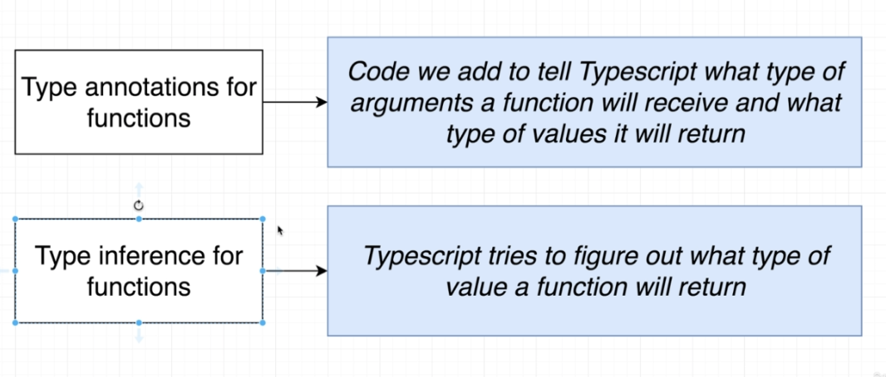

# TypeScript Guide - Type Annotations with Functions
Quick Links: [ReadMe](../README.md) | [Table of Contents](00-index.md)

---

## Type Annotations with Functions

With functions we can specify the types of the arguments as well as the type of the value being returned.

> **Note:** Type Inference only works around the return value from a function. 
So it will try to figure out what type of value you are returning from a function, but not what type of values the arguments are.

This means we will ALWAYS add type annotations for function arguments.


|
|--


#### Annotating Function Arguments and Return Values
```ts
const add = (a: number, b: number): number => {
  return a + b;
};
```

> **Note:** Type Inference also does not check your LOGIC to ensure your code does the correct thing. So if we wrote the above function as follows, TypeScript does not care. For Example:

```ts
const add = (a: number, b: number): number => {
  return a - b;
};
```

> **Note:** Even though TypeScript will infer the return value, we will **ALWAYS** add type annotations for the return value as well. The reason is that we could easily make a mistake writing the function. For example: 

```ts
const subtract = (a: number, b: number): number => {
  // no return statement
  a - b;
};
```

#### Annotating Arrow Functions
```ts
const subtract = (a: number, b: number): number => {
  return a - b;
};
```

#### Annotating Named Functions
```ts
function divide(a: number, b: number): number {
  return a / b;
}
```

#### Annotating Anonymous Functions assigned to a variable
```ts
const multiply = function(a: number, b: number): number {
  return a * b;
}
```

#### Annotating Function Return Types: Void and Never
```ts
const logger = (message: string): void => {
  console.log(message);
  // can use void to return null or undefined
};

// never indicates the function will not just return nothing, it will never return
const throwError = (message: string): never => {
  throw new Error(message);
};
```

<br />

#### Functions as Types

Given we have a variable that references a function, that variable also has a type:

```ts
function add(num1: number, num2: number): number {
  return num1 + num2;
}

// using the 'Function' type
const myAdd: Function = add;
```

We can improve upon this though using the arrow notation:

```ts
const myAdd: (a: number, b: number) => number = add;
```

Here we are saying `myAdd` is a function that accepts two parameters (a, which is a number and b which is also a number) and returns a number.

<br />

#### Destructuring and Annotations

```ts
const todaysWeather = {
  date: new Date(),
  weather: 'sunny'
};

// const logWeather = (forecast: { date: Date, weather: string }): void => {
//   console.log(forecast.date);
//   console.log(forecast.weather);
// };

const logWeather = ({ date, weather }: { date: Date, weather: string }): void => {
  console.log(date);
  console.log(weather);
};

logWeather(todaysWeather);
```

#### Function Types and Callbacks

```ts
function addAndHandle(num1: number; num2: number; cb: (num: number) => void): void {
  const result = num1 + num2;
  cb(result);
}

// usage
addAndHandle(10, 20, (res) => {
  console.log(res);
});
```