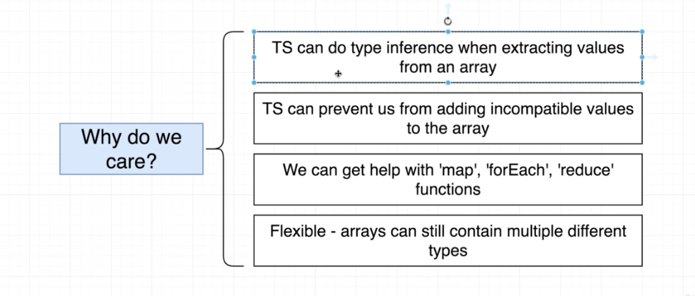

# TypeScript Guide - Type Annotations with Arrays
Quick Links: [ReadMe](../README.md) | [Table of Contents](00-index.md)

---

## Type Annotations with Arrays

**Typed Arrays**

Arrays where each element is some consistent type of value.

#### Annotating Arrays of Primitives

When we declare and initialize an array of a single type, TypeScript can infer (using type inference) the type of the array elements and we do not need to annotate the type.

```ts
// TypeScript knows that elements of carMakers will be of type string
const carMakers = ['ford', 'toyota', 'chevy'];
```

We want to add annotations when we initialize an array as an empty array.

```ts
// TypeScript does not know the type so we need to tell it
const carMakers: string[] = [];
```

<br />


#### Annotating Arrays of Complex Objects and Two Dimensional Arrays

Again, we do not need to annotate the type if we initialize the array when we define it. We only add type definitions if we do not initialize the array when we define / declare it.

```ts
// Complex Objects - Dates
const dates = [new Date(), new Date()];
```

```ts
// Two Dimensional Arrays
const carsByMake: string[][] = [
  ['f150'],
  ['corolla'],
  ['camaro'],
];
```

<br />

#### Why do we care ?

|
|--

> **Code Examples**

```ts
// here we get help when we hover over car
const car = carMakers[0];

// here we get an error if we try to push a number onto an array of strings
carMakers.push(100);

// help with map and autocomplete on the variable being passed in
carMakers.map((car: string): string => {
  return car;
});

// Flexible Types
const importantDates: (Date | string)[] = [new Date(), '2030-10-10'];

```

<br />

#### When to use typed arrays ?

Any time we need to represent a collection of records with some arbitrary sort order.