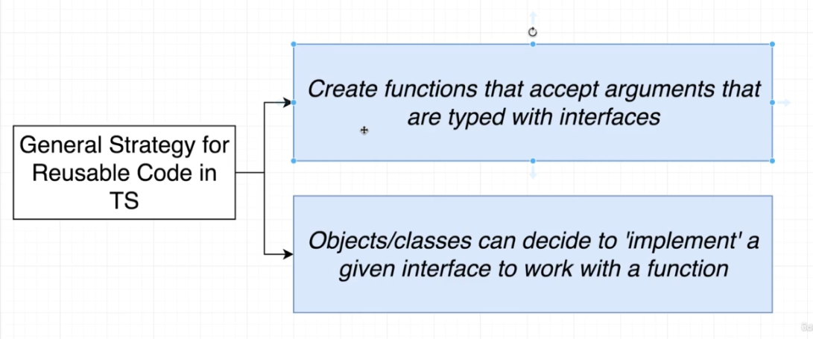
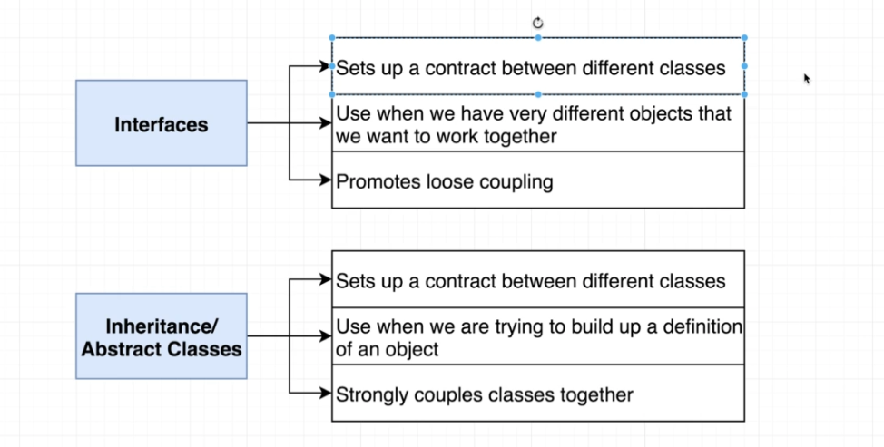

# TypeScript Guide - Interfaces
Quick Links: [ReadMe](../README.md) | [Table of Contents](00-index.md)

---

## Interfaces

An interface creates a new type, describing the property names and value types of an object. An interface is kind of like a variable that refers to a type.

You can also think of an interface as a contract that states what needs to be done but doesn’t specify how it will be done.

An interface contains the name of all the properties along with their types. It also includes the signature for functions along with the type of arguments and return type.

Interfaces contain only the declaration of the members. It is the responsibility of the deriving `class` to define the members.

A class or function can implement an interface to define the implementation of the properties as defined in that interface.

<br />

#### General Code Reuse Strategy

Interfaces + Classes = How we get really strong code reuse in TS.

|
|--

<br />


#### Defining an Interface

```ts
interface Vehicle {
  name: string;
  miles: number;
  year: Date;
};
```

<br />

#### Functions in Interfaces

An interface can also be used for defining the structure of a function.

```ts
interface Vehicle {
  name: string;
  miles: number;
  year: Date;
  summary(): string; // here string is the return value for the function
};
```

<br />

#### Implementing Interfaces

You can use an implements clause to check that a class satisfies a particular interface. An error will be issued if a class fails to correctly implement it:

```ts
interface Pingable {
  ping(): void;
}
 
class Sonar implements Pingable {
  ping() {
    console.log("ping!");
  }
}
 
class Ball implements Pingable {
// Class 'Ball' incorrectly implements interface 'Pingable'.
// Property 'ping' is missing in type 'Ball' but required in type 'Pingable'.
  pong() {
    console.log("pong!");
  }
}
```

Classes may also implement multiple interfaces, e.g. class C implements A, B {.

>**Note**
It’s important to understand that an implements clause is only a check that the class can be treated as the interface type. It doesn’t change the type of the class or its methods at all.

<br />

#### Optional Properties in Interfaces

You can use the ? to indicate a property or function is optional.

```ts
interface Vehicle {
  name: string;
  miles: number;
  year: Date;
  broken?: boolean; // here, the broken property is optional
};
```

#### Read-only properties

Read-only properties cannot be changed once they are initialized.

```ts
interface Vehicle {
  name: string;
  readonly miles: number;
  year: Date;
};
```

#### Using Generics in Interfaces

> **[HOLD]**

<br />

#### Using a class as an interface

A class declaration creates two things: a type representing instances of the class and a constructor function. Because classes create types, you can use them in the same places you would be able to use interfaces.

```ts
class Point {
  x: number;
  y: number;
}
 
interface Point3d extends Point {
  z: number;
}
 
let point3d: Point3d = { x: 1, y: 2, z: 3 };
```

<br />

#### Type Aliases

Type aliases create a new name for a type. Type aliases are sometimes similar to interfaces, but can name primitives, unions, tuples, and any other types that you’d otherwise have to write by hand.

```ts
type User = { 
  name: string;
  age: number;
};

// usage
function greet(user: User) {
  console.log('Hi, my name is ' + user.name);
}
```

Aliasing doesn’t actually create a new type - it creates a new name to refer to that type.

Aliasing a primitive is not terribly useful, though it can be used as a form of documentation.

```ts
type Second = number;
```


#### Interface vs Type Alias

Type aliases are sometimes similar to interfaces, but can name primitives, unions, tuples, and any other types that you’d otherwise have to write by hand.

Almost all features of an interface are available in type, the key distinction is that a type cannot be re-opened to add new properties vs an interface which is always extendable.

Because an interface more closely maps how JavaScript objects work by being open to extension, we recommend using an interface over a type alias when possible.

On the other hand, if you can’t express some shape with an interface and you need to use a union or tuple type, type aliases are usually the way to go.

<br />

#### Interfaces vs Abstract Classes

|
|--

**Interfaces**
An interface is defined as a syntactical contract that all the classes inheriting the interface should follow. The interface defines the 'what' part of the syntactical contract and the deriving classes define the 'how' part of the syntactical contract.
Interfaces define properties, methods, and events, which are the members of the interface. Interfaces contain only the declaration of the members. It is the responsibility of the deriving class to define the members.

**Abstract Classes**
Abstract classes are closely related to interfaces. They are classes that cannot be instantiated (ie: you cannot create an instance of them), and are frequently either partially implemented, or not implemented at all. 
The purpose of an abstract class is to provide a common definition of a base class that multiple derived classes can share.
Basically: Abstract classes are only meant to act as a base class and you would inherit or derive a subclass (or multiple subclasses) from them, then create an instance of the subclass(es). 


<br />

#### Benefits of Interfaces

 - Interfaces help in defining a concrete plan for the implementation of an entity and provide a great way to enforce consistency across objects which is useful in a variety of scenarios.

 - In addition to consistency, interfaces can also be used to ensure that proper data is passed to properties, constructors and functions. i.e. They allow several classes to share a standard set of methods and constants without requiring these methods and constants to be implemented by a common superclass.

 - Interfaces also provide additional flexibility in an application and make it more loosely coupled.

 - Interfaces allow us to implement polymorphic behaviour. Ofcourse,abstract classes can also be used to implement polymorphic behaviour.

 - Interfaces enable mocking for better unit testing.

 - Interfaces are great for implementing Inverson of Control or Dependancy Injection.

<br />

#### References

 - [https://www.typescriptlang.org/docs/handbook/advanced-types.html](https://www.typescriptlang.org/docs/handbook/advanced-types.html)

 - [https://weblogs.asp.net/dwahlin/the-role-of-interfaces-in-typescript](https://weblogs.asp.net/dwahlin/the-role-of-interfaces-in-typescript)
