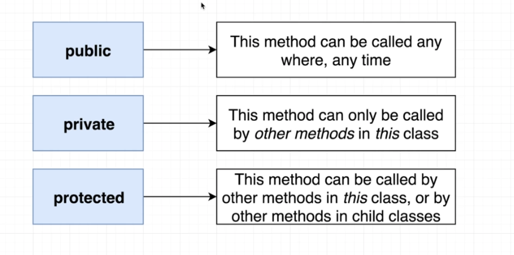

# TypeScript Guide - Classes
Quick Links: [ReadMe](../README.md) | [Table of Contents](00-index.md)

---

## Classes

A class is a blueprint to create an object with some fields / properties (values) and methods (functions) to represent a 'thing'.

#### Defining a Class

```ts
// blueprint to 'make' a Vehicle
class Vehicle {
  drive(): void {
    console.log('chugga chugga');
  }
}

// creates a new Vehicle object
const vehicle = new Vehicle();
```

Notice how the constructor is optional.

#### Defining Fields (Properties) using the Constructor

You can have fields (properties) in a class and initialize them when creating the object by passing the value into the constructor as follows:


```ts
class Greeter {
  greeting: string;
 
  constructor(message: string) {
    this.greeting = message;
  }
 
  greet() {
    return "Hello, " + this.greeting;
  }
}
 
let greeter = new Greeter("world");
```

**Short Hand property declatation and initialization**

This is such a common pattern that TypeScript provides a shorthand where you can prefix the property with an access modifier and it is automatically declared on the class and copied from the constructor. So the previous example can be re-written as:

```ts
class Greeter {

  constructor(public message: string) {}

  greet() {
    return "Hello, " + this.message;
  }
}
```

<br />

#### Class Methods

A function property on a class is called a method. Methods can use all the same type annotations as functions and constructors as seen above with the greet method.

**Class Methods as Arrow Functions**

If you have a function that will often be called in a way that loses its this context, it can make sense to use an arrow function property instead of a method definition:

```ts
class MyClass {
  name = "MyClass";
  getName = () => {
    return this.name;
  };
}
const c = new MyClass();
const g = c.getName;
// Prints "MyClass" instead of crashing
console.log(g());
```

This has some trade-offs:

 - The this value is guaranteed to be correct at runtime, even for code not checked with TypeScript
 - This will use more memory, because each class instance will have its own copy of each function defined this way
 - You can’t use super.getName in a derived class, because there’s no entry in the prototype chain to fetch the base class method from


#### Basic Inheritance

Classes in TypeScript (like other languages) support single inheritance using the extends keyword.
Here class Car extends (or inherits) the parent Vehicle class.

The child class reuses all fields and methods of the parent class (common part) and can implement its own (unique part). The idea of inheritance implements the IS-A relationship.

```ts
class Vehicle {

  drive(): void {
    console.log('chugga chugga');
  }

  honk(): void {
    console.log('beep');
  }

}

class Car extends Vehicle {

  // drive overrides the drive method on the parent class
  drive(): void {
    console.log('vroom');
  }
}

const car = new Car();

car.drive();
car.honk();

```

> **Note:**
If you have a constructor in your class then you must call the parent constructor from your constructor (TypeScript will point this out to you).
This ensures that the stuff that it needs to set on this gets set.
Followed by the call to super you can add any additional stuff you want to do in your constructor.

```ts
class Vehicle {
  color: string;

  constructor(color: string) {
    this.color = color;
  }
}

class Car extends Vehicle {

  constructor(public wheels: number, color: string) {
    super(color);
  }
}

const car = new Car(4, 'red');
```

<br />

#### Public, private and protected modifiers (Encapsulation)

The implementation and state of each object are privately held inside a defined boundary: a class. Other objects do not have direct access to this state or the authority to make changes but are only able to call a list of public functions, or methods.

Encapsulation is implemented by using access specifiers.

In TypeScript, each member is public by default however you may still mark a member public explicitly.

|
|--

**Note:**

We do not mark methods as being private over any security concern and we do not add any layer of application security. 

The only reason to mark something as private is to restrict the different methods that other developers can call.

<br />

#### Accessors

TypeScript supports getters/setters as a way of intercepting accesses to a member of an object. This gives you a way of having finer-grained control over how a member is accessed on each object.

> **Example: Convert a simple class to use get and set**

Taken from the [TypeScript Handbook](https://www.typescriptlang.org/docs/handbook/classes.html#accessors)

```ts
class Employee {
  fullName: string;
}
 
let employee = new Employee();
employee.fullName = "Bob Smith";
 
if (employee.fullName) {
  console.log(employee.fullName);
}
```

While allowing people to randomly set fullName directly is pretty handy, we may also want enforce some constraints when fullName is set.

In this version, we add a setter that checks the length of the newName to make sure it’s compatible with the max-length of our backing database field. If it isn’t we throw an error notifying client code that something went wrong.

To preserve existing functionality, we also add a simple getter that retrieves fullName unmodified.

```ts
const fullNameMaxLength = 10;
 
class Employee {
  private _fullName: string = "";
 
  get fullName(): string {
    return this._fullName;
  }
 
  set fullName(newName: string) {
    if (newName && newName.length > fullNameMaxLength) {
      throw new Error("fullName has a max length of " + fullNameMaxLength);
    }
 
    this._fullName = newName;
  }
}
 
let employee = new Employee();
employee.fullName = "Bob Smith";
 
if (employee.fullName) {
  console.log(employee.fullName);
}
```

<br />

#### Static Properties

TypeScript classes support static properties that are shared by all instances of the class. A natural place to put (and access) them is on the class itself and that is what TypeScript does:

```ts
class Something {
    static instances = 0;
    constructor() {
        Something.instances++;
    }
}

var s1 = new Something();
var s2 = new Something();
console.log(Something.instances); // 2
```

<br />

#### Using a class as a type

As mentioned previously, a class declaration creates two things: a type representing instances of the class and a constructor function. Because classes create types, you can use them in the same places you would be able to use interfaces or types.

```ts
// Class Definition
class Todo {
  id: string;
  text: string;

  constructor(todoText: string) {
    this.text = todoText;
    this.id = new Date().toISOString();
  }
}

export default Todo;
```

```tsx

// Using a Class for Type Definition
import Todo from './Todo.ts';

const Todos: React.FC<{ items: Todo[] }> = (props) => {
  return (
    <ul>
      {props.items.map(item =>
        (<li key={item.id}>
          {item.name}
        </li>
        )
      )}
    </ul>
  );
};
```

<br />

#### Abstract classes and members

Classes, methods, and fields in TypeScript may be `abstract`.

An `abstract method` or `abstract field` is one that hasn’t had an implementation provided. These members must exist inside an abstract class, which cannot be directly instantiated. Abstract members cannot be directly accessed and a child class must provide the functionality.

`abstract classes` cannot be directly instantiated. Instead the user must create some class that inherits from the abstract class.

The role of abstract classes is to serve as a base class for subclasses which do implement all the abstract members. When a class doesn’t have any abstract members, it is said to be concrete.

```ts
abstract class Base {
  abstract getName(): string;
 
  printName() {
    console.log("Hello, " + this.getName());
  }
}
// Cannot create an instance of an abstract class.
// const b = new Base();

class Derived extends Base {
  getName() {
    return "world";
  }
}
 
const d = new Derived();
d.printName();
```

<br />


#### References

 - [https://www.typescriptlang.org/docs/handbook/2/classes.html](https://www.typescriptlang.org/docs/handbook/2/classes.html)

  - [https://www.typescriptlang.org/docs/handbook/classes.html](https://www.typescriptlang.org/docs/handbook/classes.html)

 - [https://basarat.gitbook.io/typescript/future-javascript/classes](https://basarat.gitbook.io/typescript/future-javascript/classes)

 - [https://www.digitalocean.com/community/tutorials/how-to-use-classes-in-typescript](https://www.digitalocean.com/community/tutorials/how-to-use-classes-in-typescript)


