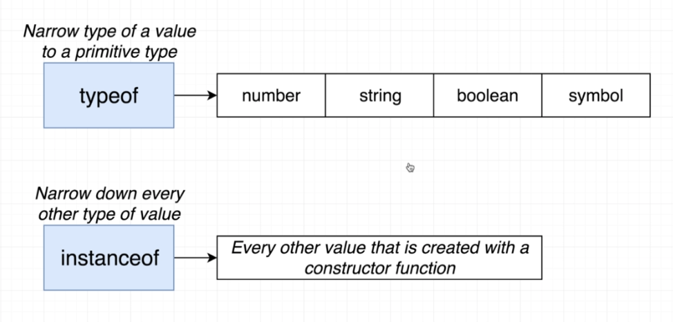

# TypeScript Guide - Narrowing (Type Guards)
Quick Links: [ReadMe](../README.md) | [Table of Contents](./docs/00-index.md)

---

## Type Guards

A type guard is an expression that performs a runtime check that guarantees the type in the current scope. Type Guards allow you to narrow down the type of an object within a conditional block.

Type guards are incredibly useful for narrowing types, satisfying the TS compiler, and helping to ensure runtime type-safety.

The most common scenario in which you’d want to use one is when a type you’re given isn’t as specific as you’d like (Vehicle versus the more specific Car).

There are built-in type guards that you can use (typeof and instanceof) but they have limited use in functional programming.

If you need more flexible type guards you can define your own with a type predicate (vehicle is Car), and a “unique” property of the type you want.


#### Built-In Type Guards

TypeScript comes with some built-in type guards: `typeof` and `instanceof`.

|
|--

The catch is that `typeof` only performs a shallow type-check. It can determine if a variable is a generic object, but cannot tell you the shape of the object.

You can use `instanceof` to check if a variable is an instance of a given class. There’s just one catch here: `instanceof` only works for classes


#### Custom Type Guards (Type Predicates)

Both typeof and instanceof are useful, but have limited scope in modern, functional programming. So how can you check the type of any object? Luckily, you can create custom type guards.

The key features of a custom type guard are:

1. Returns a type predicate, e.g. variableToCheck is Car

2. Contains a logical statement that can accurately determine the type of the given variable, e.g (variableToCheck as Car).turnSteeringWheel !== undefined

**Examples:**

```ts
const isNumber = (variableToCheck: any): variableToCheck is number =>
  (variableToCheck as number).toExponential !== undefined;

const isString = (variableToCheck: any): variableToCheck is string =>
  (variableToCheck as string).toLowerCase !== undefined;
```

#### Type Predicates

A `type predicate`, is the return type of a special function.

```ts
function isFish(pet: Fish | Bird): pet is Fish {
  return (pet as Fish).swim !== undefined;
}
```

here, `pet is Fish` is the predicate.

A `type predicate` takes the form `parameterName is Type`, where `parameterName` must be the name of a parameter from the current function signature.

When a function returns this, it tells the compiler that the type of the thing passed in will be narrowed. That is, the type will become more specific.

Any time the function is called with some variable, TypeScript will narrow that variable to that specific type if the original type is compatible.

```ts
// Both calls to 'swim' and 'fly' are now okay.
let pet = getSmallPet();
 
if (isFish(pet)) {
  pet.swim();
} else {
  pet.fly();
}
```

<br />

#### Generic Type Guards

If you have a lot of types to check though, it could become quite tedious to create and maintain a unique type guard for each type.

That’s where another awesome TypeScript feature comes in: generics.

```ts
export const isOfType = <T>(varToBeChecked: any, propertyToCheckFor: keyof T): varToBeChecked is T =>
  (varToBeChecked as T)[propertyToCheckFor] !== undefined;
```

And you can use it like this: 

```ts
if (isOfType<Car>(vehicle, 'turnSteeringWheel')) {
  ...
}
  ```

> **Warning**
These type guards are fairly naïve. In the Car example, we’re assuming that turnSteeringWheel is unique to Cars. The type guard asserts that if turnSteeringWheel exists on the given variable, then it’s a Car.
But this might not be true. You could also have a Bus type. In this scenario, there isn’t a problem with the Bus being cast as a Car, because we’re only calling turnSteeringWheel which happens to exist on both types. However this might be a problem for you in more complex scenarios, so use type guards responsibly.

<br />

#### References:

 - [https://www.typescriptlang.org/docs/handbook/advanced-types.html](https://www.typescriptlang.org/docs/handbook/advanced-types.html)
 - [https://www.typescriptlang.org/docs/handbook/2/narrowing.html](https://www.typescriptlang.org/docs/handbook/2/narrowing.html)
 - [https://rangle.io/blog/how-to-use-typescript-type-guards/](https://rangle.io/blog/how-to-use-typescript-type-guards/)