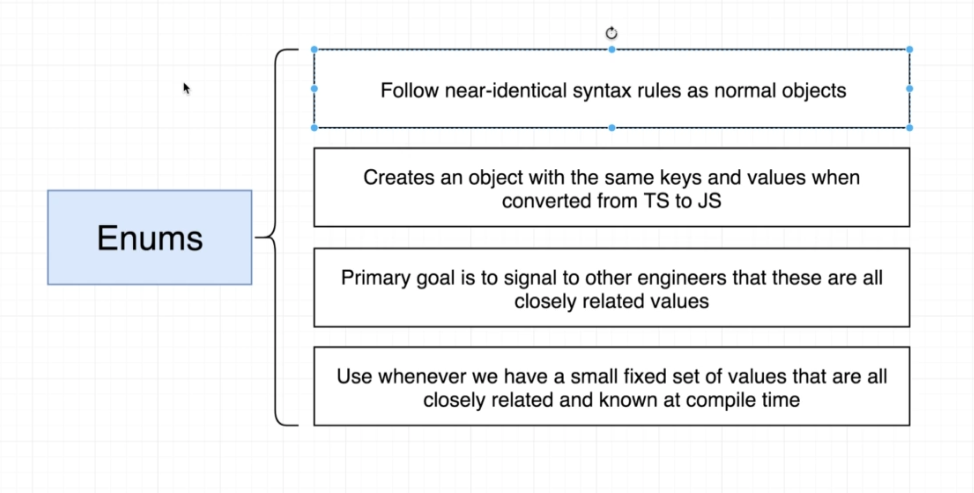

# TypeScript Guide - Enums
Quick Links: [ReadMe](../README.md) | [Table of Contents](00-index.md)

---

## Enums

Enums allow a developer to define a set of named constants. Using enums can make it easier to document intent, or create a set of distinct cases. TypeScript provides both numeric and string-based enums.

|
|--

#### Numeric enums

```ts
enum Direction {
  Up = 1,
  Down,
  Left,
  Right,
}
```

Above, we have a numeric enum where Up is initialized with 1. All of the following members are auto-incremented from that point on. In other words, Direction.Up has the value 1, Down has 2, Left has 3, and Right has 4.

Here, Up would have the value 0, Down would have 1, etc.

#### String enums

String enums are a similar concept, but have some subtle runtime differences as documented below. In a string enum, each member has to be constant-initialized with a string literal, or with another string enum member.

```ts
enum Direction {
  Up = "UP",
  Down = "DOWN",
  Left = "LEFT",
  Right = "RIGHT",
}
```

While string enums don’t have auto-incrementing behavior, string enums have the benefit that they “serialize” well. In other words, if you were debugging and had to read the runtime value of a numeric enum, the value is often opaque - it doesn’t convey any useful meaning on its own (though reverse mapping can often help), string enums allow you to give a meaningful and readable value when your code runs, independent of the name of the enum member itself.

#### References

 - [https://www.typescriptlang.org/docs/handbook/enums.html](https://www.typescriptlang.org/docs/handbook/enums.html)