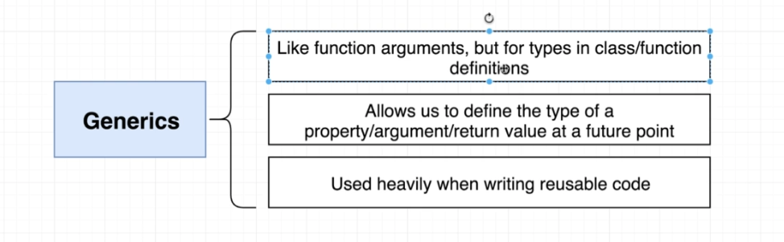

# TypeScript Guide - Generics
Quick Links: [ReadMe](../README.md) | [Table of Contents](./docs/00-index.md)

---

## Generics

|
|--

The easiest way to think of generics is to think of them like function arguments.

When we call a function, we pass in an argument to customize how the function works. When we use a generic, we are saying, when we create an instance of the class we're going to pass in an argument of sorts, to customize how the class works.

#### Generic Functions

**Hello World of Generics**

> **Note:** The following is taken straight from the [TypeScript Handbook](https://www.typescriptlang.org/docs/handbook/2/generics.html#hello-world-of-generics) because it is so well written.

To start off, let’s do the “hello world” of generics: the identity function. The identity function is a function that will return back whatever is passed in. You can think of this in a similar way to the echo command.

Without generics, we would either have to give the identity function a specific type:

```ts
function identity(arg: number): number {
  return arg;
}
```
Or, we could describe the identity function using the `any` type:

```ts
function identity(arg: any): any {
  return arg;
}
```

While using `any` is certainly generic in that it will cause the function to accept any and all types for the type of arg, we actually are losing the information about what that type was when the function returns. If we passed in a number, the only information we have is that any type could be returned.

Instead, we need a way of capturing the type of the argument in such a way that we can also use it to denote what is being returned. Here, we will use a `type variable`, a special kind of variable that works on types rather than values.

```ts
function identity<Type>(arg: Type): Type {
  return arg;
}
```

We’ve now added a type variable Type to the identity function. This Type allows us to capture the type the user provides (e.g. number), so that we can use that information later. Here, we use Type again as the return type. On inspection, we can now see the same type is used for the argument and the return type. This allows us to traffic that type information in one side of the function and out the other.

We say that this version of the identity function is generic, as it works over a range of types. Unlike using any, it’s also just as precise (ie, it doesn’t lose any information) as the first identity function that used numbers for the argument and return type.

Once we’ve written the generic identity function, we can call it in one of two ways. The first way is to pass all of the arguments, including the type argument, to the function:

```ts
let output = identity<string>("myString");
```

Here we explicitly set Type to be string as one of the arguments to the function call, denoted using the <> around the arguments rather than ().

The second way is also perhaps the most common. Here we use `type argument inference` — that is, we want the compiler to set the value of Type for us automatically based on the type of the argument we pass in:

```ts
let output = identity("myString");
```

Notice that we didn’t have to explicitly pass the type in the angle brackets (<>); the compiler just looked at the value "myString", and set Type to its type. While type argument inference can be a helpful tool to keep code shorter and more readable, you may need to explicitly pass in the type arguments as we did in the previous example when the compiler fails to infer the type, as may happen in more complex examples.

<br />

#### Generic Types and Interfaces

The type of a function itself can be expressed similarly to function declarations:

```ts
function identity<Type>(arg: Type): Type {
  return arg;
}
 
let myIdentity: <Type>(arg: Type) => Type = identity;
```

here, `: <Type>(arg: Type) => Type` is the type of the function.

We can also write the generic type as a generic interface:

```ts
interface GenericIdentityFn {
  <Type>(arg: Type): Type;
}
 
function identity<Type>(arg: Type): Type {
  return arg;
}
 
// using type inference
let myIdentity: GenericIdentityFn = identity;

// explicit
let myIdentity: GenericIdentityFn<number> = identity;
```

<br />

#### Generic Classes

To reiterate, the easiest way to think of generic classes is to think of them like function arguments, but for classes.

A generic class has a similar shape to a generic interface. Generic classes have a generic type parameter list in angle brackets (<>) following the name of the class.

```ts
class HoldAnything<TypeOfData> {
  data: TypeOfData;
}

// here we are telling the class that the TypeOfData is a number
const holdNumber = new HoldAnything<number>();
holdNumber.data = 123;

// now we are telling the class that the TypeOfData is a string
const holdString = new HoldAnything<string>();
holdString = 'hello';
```


#### References

 - [https://www.typescriptlang.org/docs/handbook/2/generics.html](https://www.typescriptlang.org/docs/handbook/2/generics.html)

