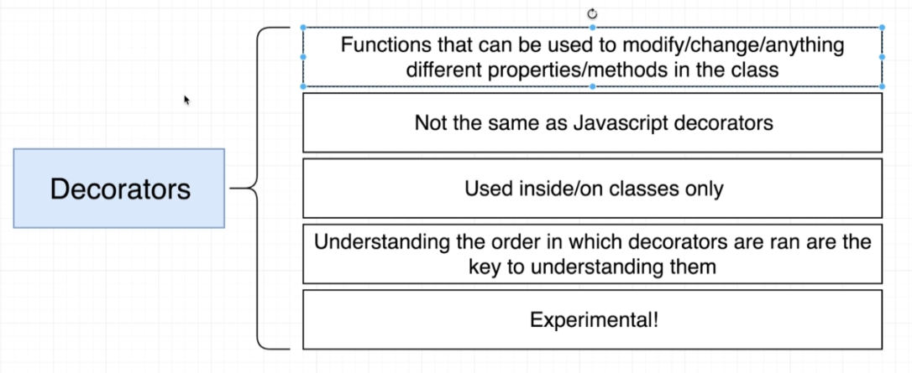
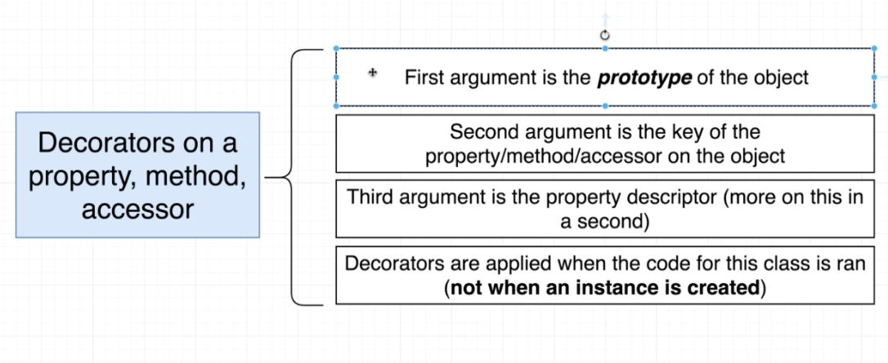

# TypeScript Guide - Decorators
Quick Links: [ReadMe](../README.md) | [Table of Contents](00-index.md)

---

## Decorators in TypeScript

|
|--

#### How Decorators work

|
|--

In a nutshell, a decorator is a pattern in programming in which you wrap something to change its behavior.

In reality, decorators are just fancy syntax and nothing more. We can run the decorator functions manually and get the exact same output.

For example: the following two code smaples would give the exact same output:

> **Using the decorator**
```ts
class Boat {
  color: string = 'red';

  get formattedColor(): string {
    return `This boats color is ${this.color}`;
  }

  // using the decorator
  @testDecorator
  pilot(): void {
    console.log('swish');
  }
}

function testDecorator(target: any, key: string): void {
  console.log('target: ', target);
  console.log('key: ', key);
}
```

> **Calling the decorator manually**

```ts
class Boat {
  color: string = 'red';

  get formattedColor(): string {
    return `This boats color is ${this.color}`;
  }

  // decorator removed
  // @testDecorator
  pilot(): void {
    console.log('swish');
  }
}

function testDecorator(target: any, key: string): void {
  console.log('target: ', target);
  console.log('key: ', key);
}

// function called here
testDecorator(Boat.prototype, 'pilot');
```

> **Note:**
Since TypeScript is a strongly typed language, you can access some additional information associated with your data types to do some cool stuff, such as runtime type-assertion and dependency injection.

### Types of Decorators

In TypeScript, decorators are functions that can be attached to class, method, accessor, property or parameter.

#### Class Decorators

When you attach a function to a class as a decorator, you’ll receive the class constructor as the first parameter.

```ts
const classDecorator = (target: Function) => {
  // do something with your class
}

@classDecorator
class Rocket {}
```

If you want to override the properties within the class, you can return a new class that extends its constructor and set the properties.

```ts
const addFuelToRocket = (target: Function) => {
  return class extends target {
    fuel = 100
  }
}

@addFuelToRocket
class Rocket {}
```

Now your Rocket class will have a fuel property with a default value of 100.

**usage**

```ts
const rocket = new Rocket()
console.log((rocket).fuel) // 100
```

<br />


#### Method Decorators

Another good place to attach a decorator is the class method. Here, you’re getting three parameters in your function: `target`, `propertyKey`, and `propertyDescriptor`.

```ts
const myDecorator = (target: Object, propertyKey: string, descriptor: PropertyDescriptor) =>  {
  // do something with your method
}

class Rocket {
  @myDecorator
  launch() {
    console.log("Launching rocket in 3... 2... 1... 🚀")
  }
}
```

The first parameter contains the class where this method lives, which, in this case, is the Rocket class. The second parameter contains your method name in string format, and the last parameter is the property descriptor, a set of information that defines a property behavior. This can be used to observe, modify, or replace a method definition.

<br />

#### Property Decorator

Just like the method decorator, you’ll get the target and propertyKey parameter. The only difference is that you don’t get the property descriptor.

```ts
const propertyDecorator = (target: Object, propertyKey: string) => {
  // do something with your property
}
```

#### Parameter Decorator

```ts
pilot(@parameterDecorator speed: string): void {
  if (speed === 'fast') console.log('swish');
  else console.log('nothing');
}

const parameterDecorator = (target: any, key: string, index: number) => {
  console.log(key, index);
}

```

<br />

#### Practical Example - Calculating Execution Time

You can use a decorator to calculate the execution time of a method:

**measure decorator:**
```ts
const measure = (
  target: Object,
  propertyKey: string,
  descriptor: PropertyDescriptor
) => {
  const originalMethod = descriptor.value;

  descriptor.value = function (...args) {
    const start = performance.now();
    const result = originalMethod.apply(this, args);
    const finish = performance.now();
    console.log(`Execution time: ${finish - start} milliseconds`);
    return result;
  };

  return descriptor;
};
```

**Usage:**
The Rocket class has a launch method inside of it. To measure the execution time of the launch method, you can attach the measure decorator.

To calculate the execution time, it uses the [Performance Hooks API](https://nodejs.org/api/perf_hooks.html) from the Node.js standard library.

```ts
class Rocket {
  @measure
  launch() {
    console.log("Launching in 3... 2... 1... 🚀");
  }
}
```


### Configuring Decorators - Decorator Factory

Anytime we want to configure a decorator (pass it some props), we will use a **decorator factory** which is just a normal function that returns a decorator.

**Decorator Factory**

```ts
// Decorator Factory definition
function logError(errorMessage: string) {
  return function(target: any, key: string, desc: PropertyDescriptor): void {
    const method = desc.value;

    desc.value = function() {
      try {
        method();
      } catch (e) {
        console.log(errorMessage);
      }
    };
  }
}

// Decorator Factory usage
@logError('oops, soemthing went wrong...')
pilot(): void {
  throw new Error();
}
```


### References
 - [https://www.typescriptlang.org/docs/handbook/decorators.html](https://www.typescriptlang.org/docs/handbook/decorators.html)
 - [https://blog.logrocket.com/a-practical-guide-to-typescript-decorators/](https://blog.logrocket.com/a-practical-guide-to-typescript-decorators/)