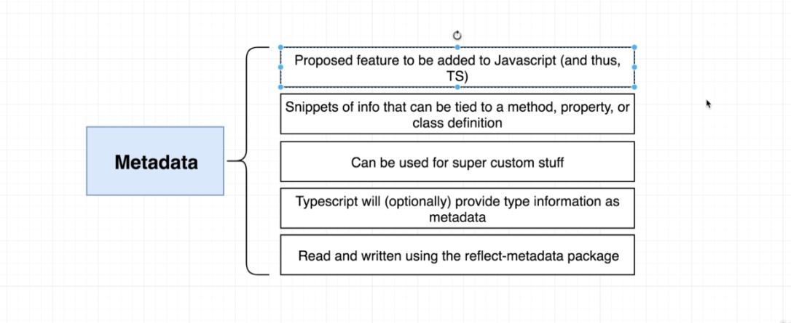

# TypeScript Guide - Metadata
Quick Links: [ReadMe](../README.md) | [Table of Contents](./docs/00-index.md)

---

## Metadata

TypeScript can optionally export some information when we convert our TypeScript code to JavaScript and this metadata information can describe some of the different types that exist inside of our application _inside_ of our JavaScript.

>**That's really important to understand, remember:**

normally, when we convert `TypeScript` to `JavaScript` all that type information inside of our TypeScript code gets wiped away. But there are some scenarios where you want to preserve some of that type information into your `JavaScript` code and you can do that by using this metadata system.

### Reflection

The name reflection is used to describe code which is able to inspect other code in the same system (or itself).

Reflection is useful for a number of use cases (Composition/Dependency Injection, Run-time Type Assertions, Testing).

### Metadata

|
|--

To work with metadata, we need to install a third party package called `reflect-metadata`.

**Note:** Using this package requires some setup in `tsconfig.ts`.

#### A Simple Example - Decorator Factory to add metadata to a function

For demo purposes, the following code shows how you can use the reflect-metadata package to create a decorator factory and apply some metadata to a method.

```ts
function addMetadataToMethod(data: string) {
  return function(target: any, key: string, description: PropertyDescriptor) {
    // 'data' is the property
    // data is the value of 'data'
    // target is the class / object to add the metadata to
    // key is property on the object that the metadata will be associated with.
    Reflect.defineMetadata('data', data, target, key);
  };
}

// useage
class Plane {
  color: string = 'red';

  @addMetadataToMethod('hi there')
  fly(): void {
    console.log('vroooom');
  }
}
```

#### Real World Example:
##### Associate route configuration information with a given route handler using metadata

The following example is a decorator factory to add a @get decorator to a route handler method in express, that will mark the function to handle get requests to the specified route:

>**Note:** This decorator must be used in conjunction with another decorator (class controller decorator) to apply the route configuration information. See the full code sample project here: [https://github.com/ChristopherHButler/sandbox-ts-express](https://github.com/ChristopherHButler/sandbox-ts-express)


```ts
import 'reflect-metadata';

export function get(path: string) {
  return function(target: any, key: string, desc: PropertyDescriptor) {
    Reflect.defineMetadata('path', path, target, key);
    Reflect.defineMetadata('method', 'get', target, key);
  }
}

// usage: login is a route handler for get requests to /login
@get('/login')
login(req: Request, res: Response): void {
  res.send(`
    <form method="POST">
      <div>
        <label>Email</label>
        <input name="email" />
      </div>
      <div>
      <label>Password</label>
      <input name="password" type="password" />
    </div>
    <button>Submit</button>
    </form>
  `);
}


// class controller decorator
// decorator factory
export function controller(routePrefix: string) {
  return function(target: Function) {
    const router = AppRouter.getInstance();

    for (let key in target.prototype) {
      const routeHandler = target.prototype[key];
      const path = Reflect.getMetadata(MetadataKeys.path, target.prototype, key);
      const method: Methods = Reflect.getMetadata(MetadataKeys.method, target.prototype, key);
      const middlewares = Reflect.getMetadata(MetadataKeys.middleware, target.prototype, key) || [];
      const requiredBodyProps = Reflect.getMetadata(MetadataKeys.validator, target.prototype, key) || [];

      const validator = bodyValidators(requiredBodyProps);

      if (path) {
        router[method](`${routePrefix}${path}`, [...middlewares], validator, routeHandler);
      }
    }
  }
}
```