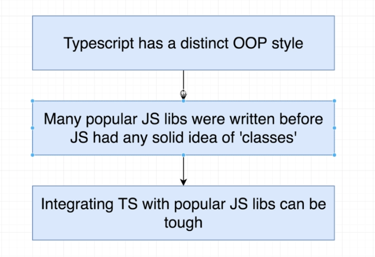
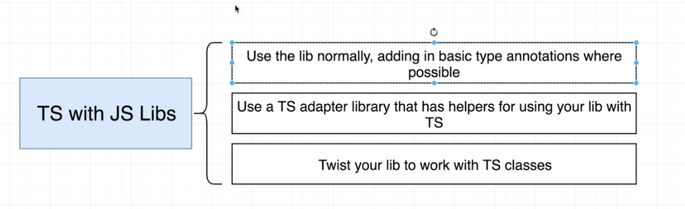
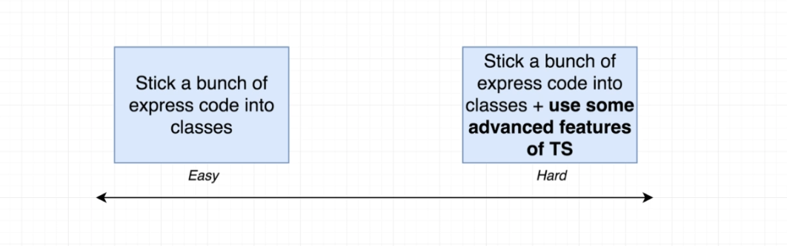
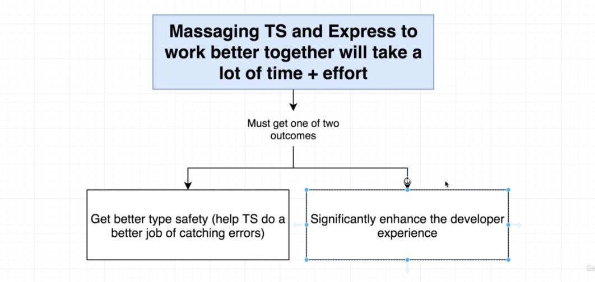

# TypeScript Guide - TypeScript + JS Libraries
Quick Links: [ReadMe](../README.md) | [Table of Contents](./docs/00-index.md)

---

## Integrting TypeScript in Existing Projects

|
|--

 - TypeScript is really meant to be used with the Object Oriented Programming style, with classes and interfaces but that doesn't always mesh so well with JavaScript libraries that were written before JavaScript had the idea of classes.

## Using TypeScript with JS Library Options

When using TypeScript with a plain JS library there is a range, or spectrum of effort you can put in to get them to work together.

|
|--

On one end of the spectrum requires little effort and the other a lot.

|
|--

If we are going to go through all the effort then we should get something in return. There is no point doing it just for the sake of it.

|
|--

