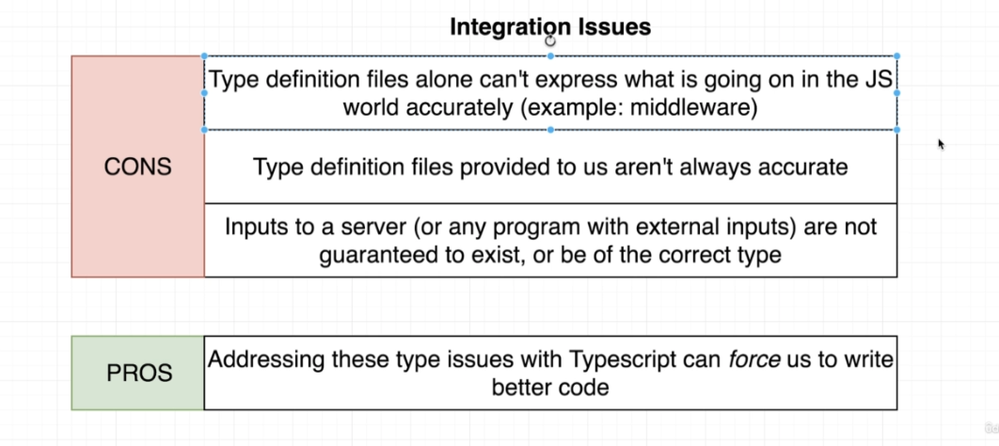

# TypeScript Guide - TypeScript + Express
Quick Links: [ReadMe](../README.md) | [Table of Contents](./docs/00-index.md)

---

## TypeScript + Express

### Getting Express to play nice with TypeScript 

#### Install the type definition files. ex:

```sh
> npm i @types/express
```

<br />

#### Basic Routes Handlers

**Adding type annotations to route arguments**

1. import types
```ts
import express, { Request, Response } from 'express';
```

2. annotate route handler function arguments
```ts
app.get('/', (req: Request, res: Response) => {

});
```

<br />

#### Route handlers using an Express Router

```ts
import { Router, Request, Response } from 'express';

const router = Router();

router.get('/login', (req: Request, res: Response) => {
  res.send(`
    <form method="POST">
      <div>
        <label>Email</label>
        <input name="email" />
      </div>
      <div>
      <label>Password</label>
      <input name="password" type="password" />
    </div>
    <button>Submit</button>
    </form>
  `);
});

export { router };
```

<br />

### Issues using TypeScript with JS Libraries

|
|--

#### Middleware

The goal of a middleware is to inspect the incoming request or outgoing response and do some processing on it. This processing can take the form of adding properties or removing properties or changing properties or anything like that.

**The BIG problem with Middleware and TypeScript**
One of the most important jobs of TypeScript is to understand the different properties that an object has.

> Middleware written in JavaScript is 100% counterproductive to what TypeScript is doing because TypeScript has no idea what properties are being added or removed.

#### Type Definition Files

The second big problem with using TypeScript with JavaScript libraries is that type definition files can be wrong.

ex: express.js type definition file for `req.body: any;` assumes we will ALWAYS be using body-parser middleware but if we are not then req.body will not exist.

**Dealing with poor type definition files**

One solution to deal with this issue is to create a custom interface with the correct types. In the case of req.body, we could create the following interface to use:

```ts
interface RequestWithBody extends Request {
  body: { [key: string]: string | undefined };
}

router.post('/login', (req: RequestWithBody, res: Response) => {
  const { email, password } = req.body;

  if (email && password) {
    ...
  }
```

This interface accounts for the fact that body may be undefined and we should use a type guard when trying to access properties on the body object.

<br />

