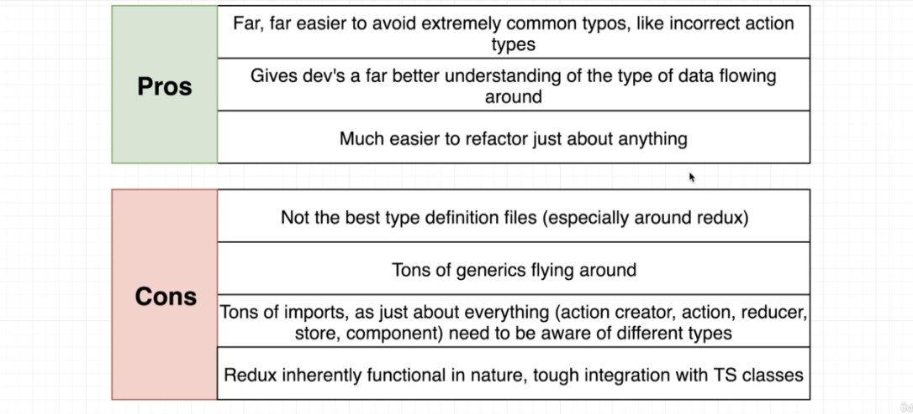

# TypeScript Guide - TypeScript + React
Quick Links: [ReadMe](../README.md) | [Table of Contents](00-index.md)

---

## TypeScript + React

Because I'm lazy and don't want to make two sets of notes, I will cover all React topics here. If there is something TypeScript specific, I will cover how to do that with React and TypeScript. If not, it will just be React.

### Pros and Cons

|
|--


### Setup

#### Using create-react-app

```ts
> npx create-react-app my-app --template typescript
```

#### non-cra apps

>**[HOLD]**
Setup for non-cra apps covered in another template project.

<br />

>**TOODO** Add notes from sg portfolio course


## References

 - [https://create-react-app.dev/docs/adding-typescript/](https://create-react-app.dev/docs/adding-typescript/)

 - [React + TypeScript Cheatsheets](https://github.com/typescript-cheatsheets/react#reacttypescript-cheatsheets)

 - [React Children with TypeScript](https://www.carlrippon.com/react-children-with-typescript/)