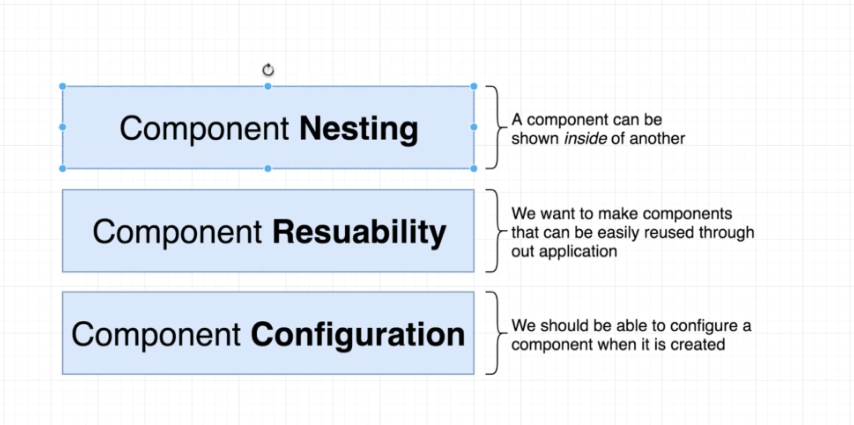

# TypeScript Guide - TypeScript + React: Components
Quick Links: [ReadMe](../README.md) | [Table of Contents](00-index.md)

---

## TypeScript + React: Components

Conceptually, components are like JavaScript functions. They accept arbitrary inputs (called “props”) and return React elements describing what should appear on the screen.

Components let you split the UI into independent, reusable pieces, and think about each piece in isolation.

>**Note: Always start component names with a capital letter.**
React treats components starting with lowercase letters as DOM tags. For example, <div /> represents an HTML div tag, but <Welcome /> represents a component and requires Welcome to be in scope.

**Three tenets of Components**

|
|--

There are two basic types of components: Functional and Class-based.

#### Functional Components

**Preferred Syntax**

 - props are destructured and uses an interface to annotate props
 - return type annotation is explicit (`JSX.Element`)

```ts
interface TodoProps {
  id: number;
  title: string;
  completed: boolean;
}

export const Todo = ({ id, title, completed }: TodoProps): JSX.Element => {
  return (
    <div>{title}</div>
  );
};
```

**Alternatives**

 - You do not need to use an interface and you could equally use a type alias,class or just inline the type declation.
 - The return type annotation of `JSX.Element` could be left off and TypeScript will infer the return type.
 - You can annotate the type of the Function itself using `React.FC` but this is discouraged for several reasons. Check the [React TypeScript Cheatsheet](https://react-typescript-cheatsheet.netlify.app/docs/basic/getting-started/function_components/) for more details.


<br />

#### Class Based Components

```ts
// props interface
interface TodoProps {
  id: number;
  title: string;
  completed: boolean;
}

// component with interface reference
class App extends Component<AppProps> {
  render() {
    return <div>{this.props.title}</div>
  }
}
```

>**Note:** defining state in a class based component using an object on the class is NOT the same as defining it via the constructor and will have very different implications.