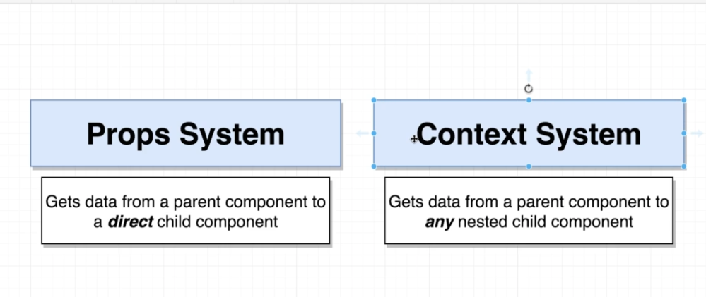
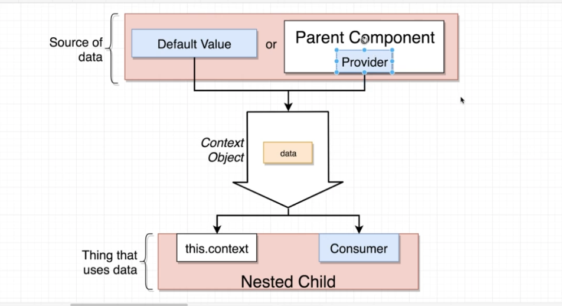

# TypeScript Guide - TypeScript + React: The Context API
Quick Links: [ReadMe](../README.md) | [Table of Contents](00-index.md)

---

## TypeScript + React: The Context API

Context provides a way to pass data through the component tree without having to pass props down manually at every level.

### Props vs. Context

|
|--

 - The props and context system is all about communicating information.
 - The only difference is HOW we communiate that information.

### The Context API

|
|--

 - The context object can be thought of as a pipe that has data flowing through it instead of water.
 - There are two ways to get data **into** the pipe: 
    1. Default value
    2. Parent Component
 - There are three ways to get data **out** of the pipe:
    1. with class components: this.context
    2. with hooks: useContext() Hook
    3. Consumer

We will use `this.context` / `useContext` hook when we want to get data out of a **single** context inside of a component.

We want to use the `Consumer` when we want to get data out of **multiple** different context objects inside of a single component.

### Creating the context

```js
import { createContext } from 'react';

const Context = createContext('Default Value');
```


### Providing the context

```js
function Main() {
  const value = 'My Context Value';
  return (
    <Context.Provider value={value}>
      <MyComponent />
    </Context.Provider>
  );
}
```


### Consuming the context


#### Functional Components

```js
import { useContext } from 'react';

function MyComponent() {
  const value = useContext(Context);

  return <span>{value}</span>;
}
```


#### Class-based Components