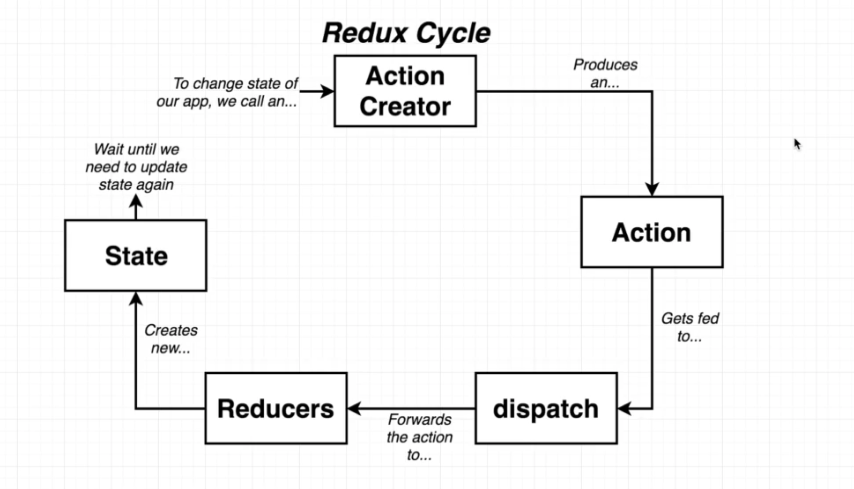
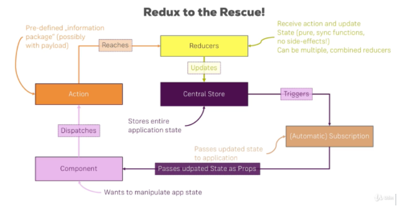
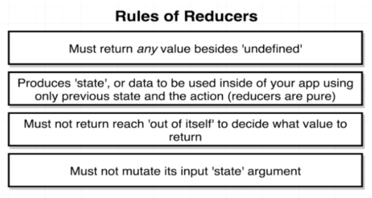
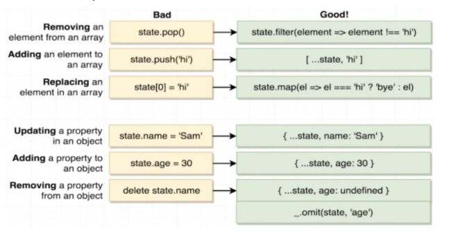
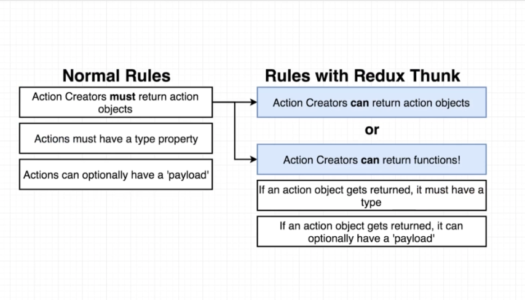

# TypeScript Guide - TypeScript + Redux
Quick Links: [ReadMe](../README.md) | [Table of Contents](00-index.md)

---

## TypeScript + Redux

Redux is an open-source JavaScript library for managing application state.

Redux is used to manage the state of our application and React is used to display things to the user as well as collect user feedback.

## TL; DR

If you just want a quick reference guide to apply types to stuff in Redux, here it is. If you want the theory, scroll down.

### "Vanilla" Redux Types

#### Store

>**Hot Tip** &nbsp; :fire:

With your reducers all individually typed, you can create and export a combined ReduxState type using Typescript's ReturnType utility. This type will contain information about every single reducer used in your application.

```ts
import { reducers } from "./reducers";
export const store = createStore(combineReducers(reducers));

export type ReduxState = ReturnType<typeof store.getState>;
```
Use this to type the state argument used by your selector functions, mapStateToProps or anywhere else that may be needed.

```ts
import { ReduxState } from "../store";

export const getDogs(state: ReduxState) {
   return state.myReducer.dogs;
}
```

#### Vanilla Action Types

**JavaScript**

In JavaScript Action types are really just strings but we can reduce errors by using a simple constant object to model action types.

```js
export const TYPES = {
  FETCH_TODOS = 'FETCH_TODOS',
  ADD_TODO = 'ADD_TODO',
  UPDATE_TODO = 'UPDATE_TODO',
  DELETE_TODO = 'DELETE_TODO',
};
```

**TypeScript**

A good pattern in TypeScript is to create action types using an enum

```ts
export enum ActionTypes {
  fetchTodos = 'FETCH_TODOS',
  addTodo = 'ADD_TODO',
  updateTodo = 'UPDATE_TODO',
  deleteTodo = 'DELETE_TODO',
}
```
>**Note:** You do not need to assign enums a value. By default it will be assigned 0, 1, 2 but that is ok because redux only requres the values to be unique.
<br />

#### Vanilla Actions

**JavaScript**

In JavaScript we can use a simple object to model an action (usually inline in an action creator.)

```js
{
  type: TYPES.FETCH_TODOS,
  payload: response.data // array of todo objects
};
```

**TypeScript**

A good pattern in TypeScript is to type an actions using an interface

```ts
interface FetchTodosAction {
  type: ActionTypes.fetchTodos;
  payload: Todo[];
}
```
<br />

#### Vanilla Action Creators

**JavaScript**

An Action Creator is a plain javascript function that returns an action.

```js
const addTodo = (todo) => {
  return {
    type: TYPES.ADD_TODO,
    payload: todo // could be a string or object or anything...
  };
};
```

**TypeScript**

It's the same in typescript, we just have to add our types to the function arguments and return type (which is the action type - our interface defined earlier).

```ts
interface Todo {
  id: number;
  title: string;
  completed: boolean;
}

const addTodo = (todo: Todo): AddTodoAction => {
  return {
    type: ActionTypes.addTodo,
    payload: todo,
  };
};
```

#### Vanilla Async Action Creators

With async action creators, we are making some network request from the action creator itself. This is sometimes called 'smart' action creators but as personal preference I would prefer to create an api service that makes network requests and just call that from the action creator. 

The following example just shows making the request from the action creator itself though.

**JavaScript**

```js
// Async Action Creator
export const fetchTodos = () => {
  return async (dispatch) => {
    const response = await axios.get(url);

    dispatch({
      type: ActionTypes.fetchTodos,
      payload: response.data,
    });
  };
};
```

**TypeScript**

```ts
const url = 'https://jsonplaceholder.typicode.com/todos';

// action types
enum ActionTypes {
  fetchTodos = 'FETCH_TODOS',
  addTodo = 'ADD_TODO',
  updateTodo = 'UPDATE_TODO',
  deleteTodo = 'DELETE_TODO',
}

interface Todo {
  id: number;
  title: string;
  completed: boolean;
}

// Action as an interface
interface FetchTodosAction {
  type: ActionTypes.fetchTodos;
  payload: Todo[];
}

// Async Action Creator
export const fetchTodos = () => {
  return async (dispatch: Dispatch) => {
    const response = await axios.get<Todo[]>(url);

    dispatch<FetchTodosAction>({
      type: ActionTypes.fetchTodos,
      payload: response.data,
    });
  };
};
```

<br />

#### Vanilla Sagas

**JavaScript**

```js
function* fetchAllExperiments() {
  try {
    yield put(actions.fetchAllExperimentsRequested());

    const response = yield call(api.getAllExperiments);
    const experiments = parseResponse(response.data);

    yield put(actions.fetchAllExperimentsSucceeded({ experiments }));
  } catch (error) {
    yield put(actions.setAlert(error));
    yield put(actions.fetchAllExperimentsFailed());
  }
}
```

**TypeScript**

```ts

```

#### Vanilla Reducers

**JavaScript**

```js
import { TYPES } from '../actions/types';

export const todosReducer = (state, action) => {
  switch (action.type) {
    case TYPES.FETCH_TODOS:
      return action.payload;
    default:
      return state;
  }
};
```

**TypeScript**

```ts
import { Todo, FetchTodosAction } from '../actions';
import { ActionTypes } from '../actions/types';

export const todosReducer = (state: Todo[] = [], action: FetchTodosAction) => {
  switch (action.type) {
    case ActionTypes.fetchTodos:
      return action.payload;
    default:
      return state;
  }
};
```

>**Hot Tip** &nbsp; :fire:

When you're creating a new reducer you can use typeof to generate the type for the reducer from your initial state. This also encourages us to fully fill out our initial state, which I find helpful for quickly understanding the purpose of each reducer.

When you export your reducer make sure to include that generated type as its return type.

```ts
const initialState = {
   dogs: 4,
   name: "Callie",
   colors: ["red", "green", "blue"]
};
type MyReducer = typeof initialState;

export default function myReducer(state = initialState, action): MyReducer {
  // ...
}
```

If your initial state doesn't include all of the values, you can include them as placeholder values such as null. In those cases you can use as <type> to indicate the intended type for that piece of state.

For example `const initialState = { person: null as Person };`

<br />

#### Vanilla Selectors

**JavaScript**

```js
export const getExperiments = state => getExperimentState(state).experiments;
```

**TypeScript**

```ts
class Experiment {
  constructor(
    public templateId: string,
    public name: string,
    public code: string,
    ...
  ) {}
}

export const getExperiments: Experiment[] = (state: ReduxState) => getExperimentState(state).experiments;
```

### Redux Types with redux-actions


### Redux Types with Redux Toolkit


## Redux Setup

As a minimum, you need the following libraries to use Redux with React:

| Library       | Description |
|---------------|-------------|
| [redux](http://redux.js.org/) | Single state management |
| [react-redux](https://github.com/reactjs/react-redux) | Connect react to redux |

The library we use to get react and redux to play together nicely is called react-redux. It is the communication glue between react and redux. 
<br />
#### Improved Developer Experience

For a better developer experience we can add in a few more libraries:

| Library       | Description |
|---------------|-------------|
| [redux-actions](https://redux-actions.js.org/) | Action creator library for easier creation of redux actions |
| [redux-saga](https://redux-saga.js.org/) | For all async side effects (redux middleware) |

<br />

## Redux Hooks (useDispatch, useSelector, useReducer) 

>**[HOLD]**

## Redux Toolkit

>**[HOLD]**

## Reselect

>**[HOLD]**

## Redux Explained
### Redux Cycle

Redux uses one-way data flow as explained by the following diagrams.

|
|--

<br />

|
|--

From the diagram and starting at a component: 

 - A component calls an action creator (and react-redux dispatches an action).

 - The action is passed to all the reducers in the application. 

 - A reducer decides (switches over an action’s type) to handle or disregard an action. 

 - A reducer updates a piece of state.

 - The store is then updated and updated state is passed to all components of the application. 

 - When mapStateToProps is called, this causes the component to re-render.

<br />

### Store

The store is simply a javascript object with a few methods on it.
It's important to note that you'll only have a single store in a Redux application.

#### Responsibilities

 - Holds application state;
 - Allows access to state via getState();
 - Allows state to be updated via dispatch(action);
 - Registers listeners via subscribe(listener);
 - Handles unregistering of listeners via the function returned by subscribe (listener).

#### [Methods](https://redux.js.org/api-reference/store)
(Follow the link for a complete list)

`getState()` - Returns the current state tree of your application.
It is equal to the last value returned by the store's reducer.

`dispatch(action)` - Dispatches an action. This is the only way to trigger a state change.
<br />

### Action Creators and Actions

#### Action Creator

An Action Creator is a plain javascript function that returns an action. 

#### Actions
An Action is a plain javascript object with a type property defined. The type property we can think of as being the command or instruction to our reducer.

Actions are payloads of information that send data from your application to your store. They are the _only_ source of information for the store. You send them to the store using `store.dispatch()`.

The `dispatch()` function can be accessed directly from the store as [store.dispatch()](https://redux.js.org/api-reference/store#dispatch), but more likely you'll access it using a helper like [react-redux](http://github.com/gaearon/react-redux)'s `connect()`. You can use `bindActionCreators()` to automatically bind many action creators to a `dispatch()` function.

Action creators can also be asynchronous and have side-effects. You can read about [async actions](https://redux.js.org/advanced/async-actions) in the official [advanced tutorial](https://redux.js.org/advanced) to learn how to handle AJAX responses and compose action creators into async control flow.

#### Action Types

It is common convention to define action types as constant variables in a types.js file inside the actions folder, to reduce the chance of making a spelling mistake. We then import the types we need into the action creator files and reducer files where we need them. 


### Dispatch

>**[HOLD]**

### Reducers

The reducer is a pure function that takes the previous state and an action, and returns the next state. It only manages a single slice of state, not the entire state object. 

**This is called reducer composition, and it's the fundamental pattern of building Redux apps.**

**Given the same arguments, it should calculate the next state and return it. No surprises. No side effects. No API calls. No mutations. Just a calculation.**

|
|--

Reducers specify how the application's state changes in response to actions sent to the store. Remember that actions only describe what happened, but don't describe how the application's state changes.

In Redux, all the application state is stored as a single object. 

Redux will call our reducer with an undefined state for the first time. This is our chance to return the initial state of our app.

Some implicit rules for reducers: 

 - We do NOT mutate the state. We create a copy.
 - We return the previous state in the default case.

#### Why we don’t mutate state

Redux will only update the store (and in turn, pass the new state to all components and call mapStateToProps and the components re-render) if the state has actually changed. 
To check if the state has changed, a triple equals comparison between the new state and the old state is performed. If we only change the object, redux will not think anything changed because both the new state and old state will both point to the same location in memory. 

#### Safe State Updates

|
|--


### Async Flow

Most apps need to reach out to the outside world to be useful — whether by talking to the server, accessing local storage, recording analytics events, or something else entirely.
That process of calling into the real world is what side-effects are. They are a way of bridging the pure Redux world with the outside world.

There are two primary ways of performing side-effects:

Inside action creators: (Redux-Thunk) It is pretty barebones but often is just enough. You make a smart action creator which performs your side-effect and may dispatch an action multiple times.

Have some code on the side respond to user actions: (Redux-Saga) Action creators are still pure, but you now have some piece of code that can listen for a specific action, perform whatever it needs to, and maybe dispatch another action.

Without middleware, Redux store only supports synchronous data flow. This is what you get by default with createStore().

You may enhance createStore() with applyMiddleware(). It is not required, but it lets you express asynchronous actions in a convenient way.

Asynchronous middleware like redux-thunk or redux-promise wraps the store's dispatch() method and allows you to dispatch something other than actions, for example, functions or Promises. Any middleware you use can then interpret anything you dispatch, and in turn, can pass actions to the next middleware in the chain. For example, a Promise middleware can intercept Promises and dispatch a pair of begin/end actions asynchronously in response to each Promise.

When the last middleware in the chain dispatches an action, it has to be a plain object. This is when the synchronous Redux data flow takes place.

### Async Action Creators 

When you call an asynchronous API, there are two crucial moments in time: the moment you start the call, and the moment when you receive an answer (or a timeout).

Each of these two moments usually require a change in the application state; to do that, you need to dispatch normal actions that will be processed by reducers synchronously. Usually, for any API request you'll want to dispatch at least three different kinds of actions:

 - **An action informing the reducers that the request began.**
The reducers may handle this action by toggling an isFetching flag in the state. This way the UI knows it's time to show a spinner.

 - **An action informing the reducers that the request finished successfully.**
The reducers may handle this action by merging the new data into the state they manage and resetting isFetching. The UI would hide the spinner, and display the fetched data.

 - **An action informing the reducers that the request failed.**
The reducers may handle this action by resetting isFetching. Additionally, some reducers may want to store the error message so the UI can display it.
<br />


### Middleware: Redux-Thunk

|
|--

The whole magic behind redux-thunk is that it allows us to return a function that gives us direct access to the dispatch method (and getState), which will allow us to wait for our api request to complete and then manually dispatch an action to all of our reducers. 


<br />

### Middleware: Redux-Saga (Generators)

Redux-saga is a library that aims to make application side effects (i.e. asynchronous things like data fetching and impure things like accessing the browser cache) easier to manage, more efficient to execute, simple to test, and better at handling failures.

Redux Saga is redux middleware and needs to be added to a redux store somewhere in the middleware chain for it to have any effect. Once added as middleware, it consumes the actions that come out of your application.

The mental model is that a saga is like a separate thread in your application that's solely responsible for side effects. redux-saga is a redux middleware, which means this thread can be started, paused and cancelled from the main application with normal redux actions, it has access to the full redux application state and it can dispatch redux actions as well.

It uses an ES6 feature called Generators to make those asynchronous flows easy to read, write and test. By doing so, these asynchronous flows look like your standard synchronous JavaScript code. (kind of like async/await, but generators have a few more awesome features we need).

You might've used redux-thunk before to handle your data fetching. Contrary to redux thunk, you don't end up in callback hell, you can test your asynchronous flows easily and your actions stay pure.

So basically..

 - An event takes place in the view layer (maybe a user clicks something)
 - An action is dispatched (from a component / container ) through a function that was declared in `mapDispatchToProps`
 - A watcher saga sees the action and does something (calls an API, a db...something async) and then dispatches some action 
 - The reducer handles the success / failure of the action and updates the store
 - The store updates components through `mapStateToProps`.

This is a bit simplified so now a bit more in depth: 

A `watcher` saga is a saga that watches for an action to be dispatched to the store, triggering a worker saga. 

#### Redux-Saga: Effects

redux-saga provides some helper effects wrapping internal functions to spawn tasks when some specific actions are dispatched to the Store. The helper functions are built on top of the lower level API.

**Fork** performs a non-blocking operation on the function passed.

**Take** pauses until action received.

**Race** runs effects simultaneously, then cancels them all once one finishes.

**Call** runs a function. If it returns a promise, pauses the saga until the promise is resolved.

**Put** dispatches an action.

**Select** Runs a selector function to get data from the state

**takeLatest** means we are going to execute the operations, then return only the results of the last one call. If we trigger several cases, it’s going to ignore all of them except the last one.

**takeEvery** will return results for all the calls triggered.

<br />


### Selectors

A selector is simply a function that takes in whole Redux state and returns a slice of the state (like selecting a small piece of the state)


### The connect helper function

Connect is an IIFE (Immediately Invoked Function Expression)

### mapStateToProps

Is a function that we define, that maps (or takes some properties off the ) application’s state and provides them (as props) to our components. This make it possible to access your reducer state objects from within your React components.

This function will subscribe to the Redux store and any updates will update props automatically. So, whenever our application’s state changes, mapStateToProps will re-run, pass in a new set of props to our component, causing our container to re-render.

We must return an object from mapStateToProps, **where the key is the new prop name to be used in the React app** and **the value is the name of the reducer function.**

You might ask.. Why didn’t you mention needing to import these reducers into your container file, like the action creators? Well connect subscribes to the store automatically and these state objects (or reducers) will be provided automatically.

mapStateToProps is also called with a second argument ownProps which is the component’s props. 

### mapDispatchToProps

mapDispatchToProps can either be a function or an object.

Is a function that we define for our containers. Anything returned from this function will end up as props on our component. 

Remember, the only way to trigger a state change in redux is to dispatch an action. The store’s reducing function will be called with the current getState() result and the given action synchronously. Its return value will be considered the next state.

So essentially the only way to update your store/state is by using ‘dispatch’ with an action creator.


## References

 - [Getting Started with Redux Toolkit](https://redux-toolkit.js.org/introduction/getting-started)
 - [Two Simple Tricks for Typing Redux Apps with Typescript](https://dev.to/xjamundx/two-simple-tricks-for-typing-redux-apps-with-typescript-1h7f)

>**Hot Tip** &nbsp; :fire:
Read this section of the Redux docs for hot tips using redux with TypeScript.

 - [Usage with TypeScript](https://redux.js.org/usage/usage-with-typescript)


